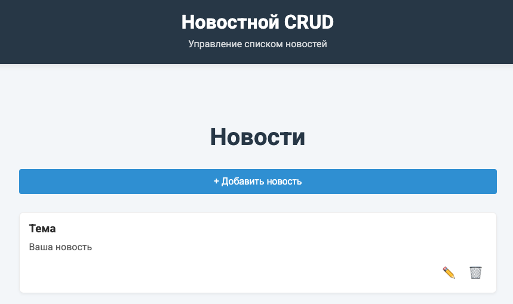

# 📰 News CRUD Application


[](https://gaigerov.github.io/news-crud)


Простое и элегантное CRUD-приложение для управления новостями с использованием React и LocalStorage.

<p align="center">
  <a href="https://gaigerov.github.io/news-crud">
    
  </a>
  <a href="https://github.com/gaigerov/news-crud/issues">
    
  </a>
</p>



## ✨ Особенности

- 📝 Полный CRUD функционал (Create, Read, Update, Delete)
- 💾 Локальное хранение данных в LocalStorage
- 📱 Полностью адаптивный дизайн
- 🎨 Анимации и плавные переходы
- 🔍 Простота использования и интуитивный интерфейс

## 🛠 Технологии

- 
- 
- 
- 

## 🚀 Быстрый старт

### Установка

1. Клонируйте репозиторий:
```bash
git clone https://github.com/Gaigerov/news-crud.git
Установите зависимости:

bash
cd news-crud
npm install
Запустите приложение:

bash
npm start
Приложение будет доступно по адресу: http://localhost:3000

Сборка для production
bash
npm run build
Деплой на GitHub Pages
bash
npm run deploy
📂 Структура проекта
text
src/
├── components/    # React компоненты
├── context/       # Контекст приложения
├── hooks/         # Кастомные хуки
├── utils/         # Вспомогательные утилиты
├── App.js         # Главный компонент
└── index.js       # Точка входа
🤝 Как внести вклад
Форкните проект

Создайте ветку для вашей фичи (git checkout -b feature/AmazingFeature)

Сделайте коммит изменений (git commit -m 'Add some AmazingFeature')

Запушьте в ветку (git push origin feature/AmazingFeature)

Откройте Pull Request

📜 Лицензия
Распространяется под лицензией MIT. См. LICENSE для подробностей.
